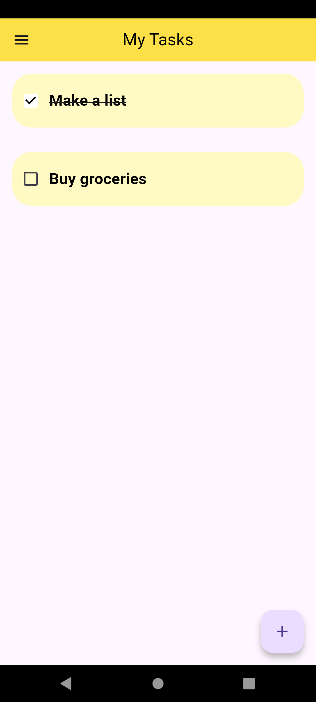
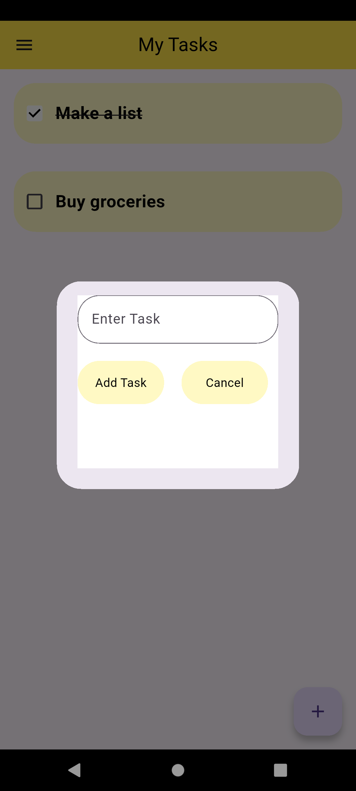
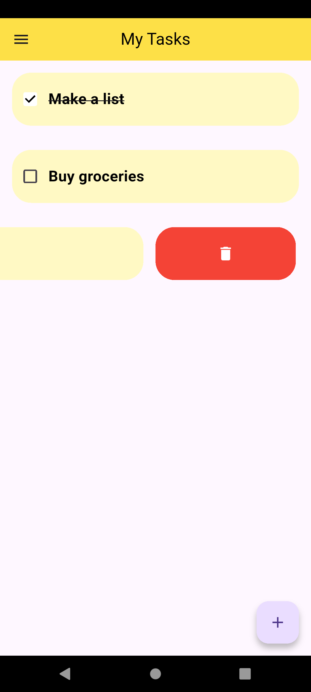
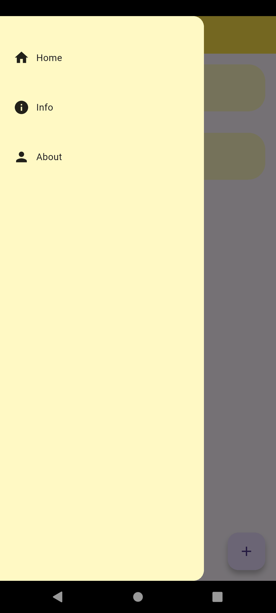

# Flutter Todo App

A simple, user-friendly Todo application built with Flutter. This app helps you keep track of your daily tasks with a clean UI and smooth interactions. 

## Features

*   **Task Management:** View your current tasks on the main screen.
*   **Add Tasks:** Easily add new tasks using a clean popup dialog box containing an input field and action buttons.
*   **Progress Tracking:** Tap a task's checkbox to mark it as done, which applies a visual strikethrough effect to the text.
*   **Swipe to Delete:** Slide a task to reveal a red delete button to quickly remove it from your list.
*   **Navigation Drawer:** Access additional app sections like Home, Info, and About through the side menu.

## Screenshots

Here is a look at the app's interface:

### Main Task List


### Add Task Dialog


### Swipe to Delete


### Navigation Drawer


## Tech Stack

*   **Framework:** Flutter
*   **Language:** Dart

## Getting Started

To run this project on your local machine, ensure you have Flutter installed.

1. Clone the repository:
   ```bash
   git clone https://github.com/TalalNasir1/todo_app.git
